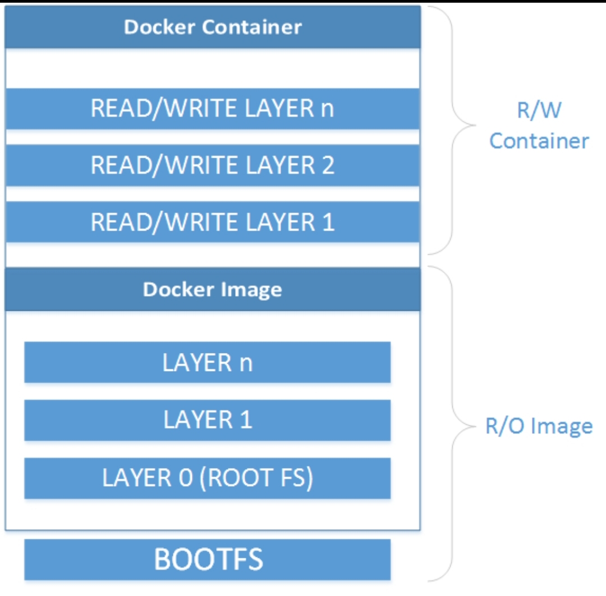

# Docker Tutorial

[TOC]

## Introduction

### What Is Docker?

According to docker :

> docker allows you to package your applications with all of its dependencies into a standardized unit for  software development.

In a detailed manner , Docker is a new open source Container-Based technology that automate the deployment of applications inside isolated Linux  container including required runtime  including required dependencies of the application. Simply , it allows you to pack your applications with the required dependencies  into a container and allow rapid deployment.

### Why Docker?

- Docker Containers Are one of the hottest technologies for applications development nowadays.
- Docker allows you to run many containers simultaneously on any host and can run anywhere whenever it is installed.
- Docker reduces run and deployment time.
- docker provides a safe way to run applications securely isolated in a container and packaged with all dependencies and libraries.
- the dockerized applications can run on any virtual platform  or bare metal without any modifications.

### Docker Benefits for Developers:

- Faster applications delivery.
- Applications portability .
- Can be used as versions Control.
- Sharing containers among team members using repositories.

### Docker Benefits for DevOps:

- Easier deploying and scaling.
- Efficient management of applications lifecycle.
- Light weight footprint: docker images are very small.
- Simplified maintenance: by reducing efforts and risk of problems with applications dependencies.

### Docker Vs Virtual Machines:


Virtual machines are more resource-intensive than Docker containers as the virtual machines need to load the entire OS to start. The lightweight architecture of Docker containers is less resource-intensive than virtual machines. 

In the case of virtual machines, resources like CPU, memory, and I/O may not be allocated permanently to containers — unlike in the case of containers, where the resource usage with the load or traffic. 

Scaling up and duplicating containers in simple and easy as compared to virtual machines because there is no need to install an operating system in them.

Apart from the major differences, some other differences are summarized below:

| Criteria          | Docker                                                       | Virtual Machines                                             |
| :---------------- | :----------------------------------------------------------- | :----------------------------------------------------------- |
| Boot-Time         | Boots in a few seconds.                                      | It takes a few minutes for VMs to boot.                      |
| Runs on           | Dockers make use of the execution engine.                    | VMs make use of the hypervisor.                              |
| Memory Efficiency | No space is needed to virtualize, hence less memory.         | Requires entire OS to be loaded before starting the surface, so less efficient. |
| Isolation         | Prone to adversities as no provisions for isolation systems. | Interference possibility is minimum because of the efficient isolation mechanism. |
| Deployment        | Deploying is easy as only a single image, containerized can be used across all platforms. | Deployment is comparatively lengthy as separate instances are responsible for execution. |
| Usage             | Docker has a complex usage mechanism consisting of both third party and docker managed tools. | Tools are easy to use and simpler to work with.              |

For more information visit this link: [Get Started With Docker](https://docs.docker.com/engine/docker-overview/)

### Docker Components

Docker has set of components that constitutes its building block including:

| Component          | Description                                                  |
| ------------------ | :----------------------------------------------------------- |
| Docker Daemon      | Runs on a host machine and responsible for docker operations without direct interaction from the user. |
| Docker Client      | Accept commands from users and communicates with docker daemon through CLI or REST API. |
| Docker Image       | Is a template or blueprint that contains all the data and metadata needed to run the containers that are launched from a certain image. |
| Docker Container   | A box that contains all large and tiny details which are needed for a dockerized application to run. Each container is created from a certain docker image and is an isolated and secure application platform. |
| Docker Registry    | A public or private hosted collection of tagged images that together create the file system for a container. |
| Docker Hub         | A Software as a Service (SaaS) platform for sharing and managing docker images. |
| Docker  Dockerfile | A text file containing a specific syntax for building docker Images. |
| Docker Swarm       | A clustering and scheduling tool for docker containers.      |

For more information visit this link: [Docker Components](https://docs.docker.com/engine/docker-overview/)

## Docker Installation

### Docker Editions

Docker is coming in two editions including:

- Docker Community Edition (CE):

  Docker-CE is for the developers and DevOps community. Each month docker releases an Edge version with latest features and in addition to quarterly releases with stable versions. it is available for the following operating systems:

  1.  ubuntu
  2. Debian
  3. CentOS
  4. Windows 10
  5. MacOS
  6. Microsoft Azure
  7. AWS

- Docker Enterprise Edition (EE):

  Docker-EE is designed for enterprise development who build, ship and run business-critical applications   in production environment.

For more information Visit this link: [Docker Editions](http://dockerdocs.gclearning.cn/install/overview/)

### Docker for Linux

Docker engine is built on the top of Linux kernel, which means that docker runs directly in any Linux distribution. there are several ways to install Docker engine om Linux Based OS Including :

1. Installation Scripts provided by Docker community.
2. Docker Package included in the official Linux distribution (but might not be the latest version).
3. packages supplied by docker for any Linux distributions.
4. Binary download from Docker repository.

The first option is to use the script provided at [here](https://get.docker.com) to install Docker engine. This script will chick installation requirements, then install the Docker engine depending on your OS. The installation process will include some extra  dependencies required by Docker in case some they are missing 

to use the script, use this command:

```
curl -s https://get.docker.com/ | sudo sh
```

For more information visit this link: [Docker for linux](https://docs.docker.com/install/)

#### Docker-CE on CentOS 7.x or RHEL 7.x

-  Add the official Docker repository:

  ```
  yum-config-manager --add-repo https://download.docker.com/linux/centos/docker-ce.repo
  ```

- Install Docker Ce Engine:

  ```
  yum install docker-ce
  ```

- Configure the docker daemon to start automatically in case if it is not started automatically after installation:

  ```
  systemctl enable docker.service
  systemctl start docker.service
  ```

  **Start enjoying Docker Services**

For more information visit this link:  [Docker for CentOS](https://docs.docker.com/install/linux/docker-ce/centos/)

#### Docker-CE on Ubuntu 16.04 LTS

- Add the GPG key for Docker repository:

  ```
  curl -fsSL https://download.docker.com/linux/ubuntu/gpg | sudu apt-key add-
  ```

- Add the official Docker repository :

  ```
  add-apt-repository "deb[arch=amd64] https://download.docker.com/linux/ubuntu/$(lsb_release -cs) stable"
  ```

- update the apt database and install Docker-CE Engine:

  ```
  apt-get update; apt-get -y install docker-ce
  ```

- Configure the docker daemon to start automatically in case if it is not started automatically after installation:

  ```
  systemctl enable docker.service
  systemctl start docker.service
  ```

**Start enjoying Docker Services**

For more information visit this link:

### Docker for Microsoft Windows

Docker desktop for windows requires Microsoft Windows 10  professional or enterprise 64-bit, to install:

- Download the Setup file from here [DockerDesktop4Windows](https://download.docker.com/win/stable/Docker%20Desktop%20Installer.exe)

- Run The setup file **Docker Desktop Installer** and wait until it downloads the required packages.

- You will encounter 3 options during Docker installation: Tick just the first two options.

- wait until the installation is completed and then restart your PC

  **Start enjoying Docker Services**

For more information visit this link: [Docker for Windows](https://docs.docker.com/docker-for-windows/install/)

## Installation Validation

### Linux

1. Open a terminal

2. Go to Powershell

3. Run 

   ```
   docker -v
   ```

   Expected Output:
   
   Docker version 19.03.5, build 633a0ea

### Windows

1. Start Docker Desktop App, wait until it's finished initializing

2. Go to Start Menu > Powerhell 

3. Run 

   ```
   docker -v
   ```
   
   Expected Output:
   
   Docker version 19.03.5 Build 633a0ea

## Docker Image

### What is docker image ?

docker Is a template or blueprint that contains all the data and metadata needed to run the containers which are launched from a certain image. You can think of it as Class in OOP, the image is comprised of a layers, each layer is a set of filesystem changes and has a unique ID upon its creation. Further, Docker image is immutable (Read-only template), the following figure descries Docker Image architecture:  


### Basic Docker image Commands

| Command        | Description                                                  |
| -------------- | ------------------------------------------------------------ |
| docker images  | List all available images.                                   |
| docker build   | Build an image from a Dockerfile.                            |
| docker commit  | Create a new image from a container's changes, pausing it temporarily if it is running. |
| docker rmi     | Remove one or more image.                                    |
| docker history | Show the history if an image.                                |
| docker tag     | Tags an image into a repository.                             |
| docker import  | Import the contents from a tarball to create file system image. |
| docker export  | Export a container's file system as a tar archive.           |
| docker search  | Search the docker hub for specific images.                   |

For more information visit this link: [Docker Image](https://docs.docker.com/engine/reference/commandline/image/)

## Docker Containers

### What is Docker Container?

Docker containers are created from docker images , you can think of it as a class instance in OOP. It differs from Docker image in creating a writable layer on the top of docker image that enables the user to commit changes on the on containerized image and create a new image out of it. Further it is also possible to have several running  containers from the same image, each of the running containers is an isolated and secure application environment, the following figure descries Docker Image architecture:



### Basic Docker container command

| Command        | Description                                                  |
| -------------- | ------------------------------------------------------------ |
| docker create  | Create a new command but do not start it                     |
| Docker run     | Create and start a container in on shoot.                    |
| docker rm      | Remove one or more containers                                |
| docker start   | Start  one or more stopped containers                        |
| docker stop    | Stop a running container                                     |
| docker restart | Restart a running container                                  |
| docker kill    | Kill a running container.                                    |
| docker attach  | Attach/connect to a running container.                       |
| Docker exec    | Perform commands in a running container.                     |
| docker ps      | Show all running containers                                  |
| docker logs    | Display the logs of certain container                        |
| docker inspect | Return a low-level information about certain container       |
| docker top     | Display the running processes of a container                 |
| docker port    | List port mappings or a specific mapping for the container   |
| docker stats   | Display a live stream of a container's resource usage statistics |
| docker diff    | Inspect changes on a container's filesystem                  |

For more information visit this link: [Docker Containers](https://docs.docker.com/engine/reference/commandline/container/)

## Docker HUB

### What is Docker HUB?

[Docker HUB](https://hub.docker.com/search?q=&type=image) is a Software as a Service (SaaS) platform provided by Docker Company that holds public and private Docker images to be downloaded Docker user for their application development.

### Docker HUB Features:

1. Central repository for public/private images.
2. Automatically creates new images on changes in source code repository.
3. Work-groups creation to mange access to image repositories.
4. Lifecycle workflow automation.

For more information visit this link: [Docker HUB Docs](https://docs.docker.com/docker-hub/)

### Simple example:

Searching for MySQL image on from public repository (Docker Hub), You can either directly search the docker HUB website to search for the desired image or doing it from the terminal or windows powershell as shown in the example which describe the looking up for python image:

```
docker search python
```

once you found the desired image, you have to download it using the following code:

```
docker pull python
```

## Docker Private Registry 

### What is Docker Private Registry?

Docker private Registry is storage system used to store the private images on a local machine. The registry server is container provided Docker company. It is highly recommended to use registry version 2 which has a greater advancement in security, reliability and efficiency over version 1. 

### Docker Registry Advantages: 

1. Securely deployed in your local environment.
2. faster deployment due to the reduced latency of pulling and pushing images.

To create a local registry, apply the following command

```
docker run -d -p 5000:5000 --restart=always --name registry -v data:/var/lib/registry registry :2 
```

in the previous command, the registry data is persisted as a docker volume on the container filesystem. and thus if you want to change the location of the registry volume, just change the director after the  parameter`-v` .

An alternative solution for private registry is to create an account on the `docker hub` from the following [link](https://hub.docker.com/signup) which provides a free-to-use, hosted Registry, plus additional features (organization accounts, automated builds, and more).

For more information visit this link: [Docker registry Docs](https://docs.docker.com/registry/)

## DockerFile

### What is Dockerfile:

simply, Dockerfile is the image creation recipe. More technically, Dockerfile is a text based file (script) that includes all commands you would normally execute manually in order to build a docker image, these commands are called dockerfile instructions. dockerfiles are always aligned on any base image and enables docker daemons to build images automatically by reading the instructions from Dockerfile.

### Dockerfile Instructions:

Dockerfiles instruction are the blueprint for creating a docker image, there are 13 command to perform in a DockerFile as shown in the table bellow but it is not necessarily  to use them ain every Dockerfile, it depends on your need:

| Instruction | Description                                                  |
| ----------- | ------------------------------------------------------------ |
| FROM        | Define the base image to start building image on top of it.  |
| MAINTAINER  | Declare the author of the generated image.                   |
| ENV         | Define one or more environment  variables in the image.      |
| RUN         | Execute any commands in a new layer the top of the current image and commit the results. |
| CMD         | Provide defaults for an executing containers.                |
| EXPOSE      | Used to associate a specified port to enable networking between the running process inside the container and the host |
| ADD         | copy new files, directories, or remote file to the container. Not highly recommended instruction because it invalidates the cache. |
| COPY        | Copy New files or directories to container.                  |
| ENTRYPOINT  | Configure a new that will run as an executable.              |
| VOLUME      | Used to enable access from your container to a directory on the host machine. |
| USER        | Set the username for the following commands : RUN, CMD and ENTRYPOINT. |
| WORKDIR     | Set the working directory                                    |

The previous table may somehow vague or ambiguous to draw a complete picture about the Dockerfiles. For this Reason, there will be a complete example on how to create a Dockerfile.

For more information visit this link: [Dockerfile Docs](https://docs.docker.com/engine/reference/builder/)

## Conclusion

Up to this point,  a large proportion of the theoretical part of Docker technology has been covered, such brief introduction enables the reader to have a clear idea about docker as well as its related issues  and concepts. In cases there is a need for extra information and further reading, a Docker documentation link is provided at the end of each section that route you directly toward the documentation provided by docker for the same topic. An extra hands-on example on how to use docker commands is provided [here]

## Todo 

- [x] Introduction

- [x] Add installation section (Windows, Linux)

- [ ] Check the installation Steps for Linux (Yazan)

- [x] Images and Containers sections

- [x] Add section on Docker hub and registry 

- [x] Add basic commands section ( has been included briefly in image and container section )

- [x] Add commands table (this needs to be descried thoroughly in a hands-on example  )

- [ ] Add A complete hands-on example that clarify the previous listed command in the tables (saeed)

- [ ] Add examples for multiple types of images ( can be created easily after the hands-on example) (saeed)

- [x] create a theoretical  about dockerfiles (saeed)

- [ ] Add a hands-on example on  docker file creation (Yazan)

- [x] Add `for more information links` directed toward the original documentation in each section 

  
  
  
